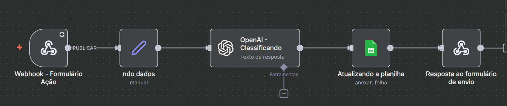

# Classificação de Leads com n8n e OpenAI 🚀

Este projeto é uma automação para captura, processamento e classificação inteligente de leads utilizando **n8n**, **OpenAI** e **Google Sheets**, com uma interface web para envio/teste de formulários.



---

## 🛠️ Tecnologias Utilizadas

- **HTML5 & CSS3:** Interface web para envio dos dados do lead.
- **n8n:** Plataforma de automação de fluxos de trabalho (Workflow).
- **OpenAI (ChatGPT):** Inteligência Artificial responsável por analisar e classificar os leads.
- **Google Sheets:** Banco de dados/Planilha para armazenar os leads classificados.
- **Webhooks:** Comunicação entre a interface web e o n8n.

---

## 📋 Pré-requisitos

Antes de começar, você precisará ter:
1. Uma instância do **n8n** rodando (localmente via Docker, n8n Cloud ou servidor próprio).
2. Uma chave de API da **OpenAI** (API Key).
3. Uma conta no **Google Cloud** com acesso à API do Google Sheets/Drive habilitada.

---

## 🚀 Como Usar e Configurar o Projeto

Siga o passo a passo abaixo para colocar a automação para funcionar:

### 1. Clonar o Repositório
```bash
git clone [https://github.com/claraliima/classificacao-leads.git](https://github.com/claraliima/classificacao-leads.git)
cd classificacao-leads
